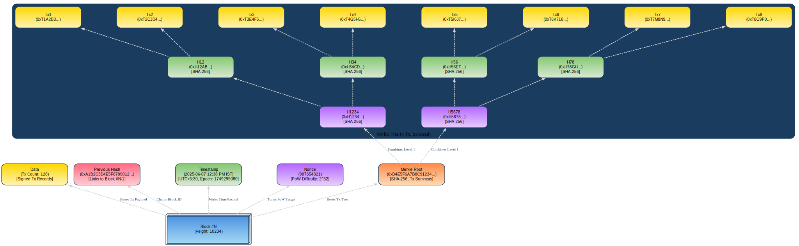

# Mini Blockchain Simulation: Understanding Fundamentals and Consensus Mechanisms

## Blockchain Basics

**Definition:**
A blockchain is a decentralized and distributed digital ledger that securely records transactions across multiple computers. Each transaction or data entry is grouped into blocks, which are linked chronologically in a chain using cryptographic hashes. This ensures data integrity, immutability, and transparency without relying on a central authority. Because every participant in the network holds a copy, tampering with one block would require changing all subsequent blocks across all nodes, making it highly secure.

**Real-life Use Cases:**

1. **Supply Chain Management:** Tracking the origin and journey of products transparently, reducing fraud and errors.
2. **Digital Identity Verification:** Providing users control over their personal data and enabling secure, tamper-proof identity management.

## Block Anatomy

**Merkle Root and Data Integrity:**
The Merkle root is a single hash that represents all transactions inside a block. It is created by repeatedly hashing pairs of transactions until only one hash remains. This structure allows efficient and secure verification of any individual transaction without revealing the entire data set. For example, if someone tries to tamper with one transaction, its hash changes, which alters the Merkle root and signals data corruption, enabling quick integrity checks.

## Consensus Conceptualization

**Proof of Work (PoW):**
PoW is a consensus mechanism where miners solve complex mathematical puzzles to add a new block to the blockchain. It requires significant computational power and energy because miners must perform many trial-and-error calculations (hashing) to find a valid nonce. This energy expenditure secures the network by making attacks costly and difficult.

**Proof of Stake (PoS):**
PoS selects validators to create new blocks based on the amount of cryptocurrency they hold and "stake" as collateral. Unlike PoW, PoS doesn’t require heavy computations, so it is energy-efficient. Validators are incentivized to act honestly because malicious behavior risks losing their staked coins.

**Delegated Proof of Stake (DPoS):**
DPoS is a variation where coin holders vote to elect a small group of trusted validators (delegates) who are responsible for producing blocks. Validators are chosen based on votes weighted by stakeholders’ holdings. This system aims to improve scalability and efficiency while maintaining decentralization through democratic selection.

#  Blockchain Platform Comparison & Analysis (Task-2)

##  Blockchain Platform Comparison Table

| **Attribute**              | **Ethereum**                             | **Hyperledger Fabric**                       | **R3 Corda**                                  |
|----------------------------|-------------------------------------------|----------------------------------------------|------------------------------------------------|
| **Type**                   | Public                                    | Private                                      | Consortium                                     |
| **Consensus Mechanism**    | Proof of Stake (PoS)                      | Pluggable (e.g., Raft, Kafka)                | Notary-based (Raft/BFT)                        |
| **Permission Model**       | Open                                      | Permissioned                                 | Permissioned                                   |
| **Speed / Throughput**     | ~30 TPS (Layer 1), scalable via Layer 2   | ~3,000 TPS                                   | ~1,000+ TPS                                    |
| **Smart Contract Support** | Yes (Solidity)                            | Yes (Go/Java/Node.js)                        | Yes (Kotlin/Java)                              |
| **Token Support**          | Yes (ETH - native)                        | No                                           | No                                             |
| **Typical Use Case**       | Decentralized apps (DApps), DeFi          | Enterprise supply chains, medical data       | Inter-bank settlements, finance                |
| **Notable Technical Feature** | Smart contracts, Layer 2 scalability  | Modular architecture, private channels       | UTXO model, point-to-point architecture        |

---

##  Short Report

Ethereum, Hyperledger Fabric, and R3 Corda represent different blockchain categories, each with distinct capabilities.

- **Ethereum**, a **public blockchain**, supports open participation and powerful smart contracts via the Ethereum Virtual Machine (EVM). However, it has limited speed on Layer 1, though Layer 2 scaling solutions help improve throughput.

- **Hyperledger Fabric**, a **private blockchain**, offers high throughput (~3,000 TPS), modular design, and fine-grained access control, making it ideal for enterprise use where security and speed are essential. Its chaincode system supports common programming languages and runs smart contracts in a controlled environment.

- **R3 Corda**, a **consortium blockchain**, is tailored for regulated industries like finance. It focuses on privacy through point-to-point communication, making it ideal for transactions between trusted parties. While not optimized for open applications, it supports JVM-based smart contracts and ensures legal compliance.

###  Platform Choices:

-  **For a decentralized app** → _**Ethereum**_  
  _Reason: Openness, token support (ETH), and strong developer tools/community._

-  **For a supply chain network among known partners** → _**Hyperledger Fabric**_  
  _Reason: Permissioned model, high throughput, and modular architecture._

-  **For an inter-bank financial application** → _**R3 Corda**_  
  _Reason: Point-to-point privacy, legal contract support, and regulatory alignment._

---

